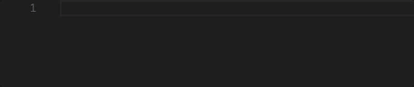

# warning

This repository will no longer be development.
If you want contribute please [go to main repository](https://github.com/bancek/vscode-bem-expand)

# BEM Expand for VS Code

You already write BEM with SCSS and enjoy using `&` for parent selector. But you also want to use it in your HTML/JSX.

